# CI/CD Pipeline Documentation

This project includes a comprehensive CI/CD pipeline using GitHub Actions that builds and tests all components of the Trippy application.

## Pipeline Overview

### 🔄 Main CI Pipeline (`ci.yml`)

Triggered on:
- Push to `master`, `main`, or `develop` branches
- Pull requests to `master` or `main` branches

**Components tested:**
1. **Backend (Java Spring Boot)**
   - Java 17 with Maven
   - Unit tests
   - Build and package JAR
   
2. **Frontend (React + Vite)**
   - Node.js 18
   - ESLint checks
   - Production build
   
3. **Admin Frontend (React + Vite)**
   - Node.js 18
   - ESLint checks
   - Production build
   
4. **Integration Verification**
   - Cross-component dependency validation
   - Artifact integrity checks
   - End-to-end build verification
   - Deployment readiness validation
   
5. **Security Scanning**
   - Comprehensive vulnerability assessment
   - Multi-format security reporting
   - Dependency security validation
   - SARIF integration with GitHub Security

**Configuration:**
- Uses `application-ci.properties` profile
- Tests run with in-memory H2 database

## 🏃‍♂️ Running CI Tests Locally

Use the provided script to run the same tests that will execute in CI:

```bash
# From project root
./run-ci-tests.sh
```

This script will:
1. Install all dependencies
2. Run backend tests
3. Run frontend and admin frontend linting
4. Build all components
5. Verify all artifacts are created

## 📁 Generated Artifacts

After successful CI runs, the following artifacts are available:

- `backend-jar`: Spring Boot JAR file
- `frontend-dist`: Frontend production build
- `admin-frontend-dist`: Admin frontend production build

## 🔧 Configuration Files

### Backend Test Configuration
- `backend/src/test/resources/application-ci.properties`: CI-specific test configuration
- `backend/pom.xml`: Maven configuration with test exclusions

### Frontend Configuration
- `frontend/package.json`: Build and lint scripts
- `admin_frontend/package.json`: Build and lint scripts

## � Integration Verification - Detailed Process

### **What Integration Verification Does:**

1. **Cross-Component Dependency Validation**
   - Runs **after** all individual component builds succeed
   - Uses GitHub Actions `needs: [backend, frontend, admin-frontend]` dependency
   - Ensures no component can pass integration if any dependency fails

2. **Artifact Download & Validation**
   ```bash
   # Downloads all build artifacts from previous jobs
   - backend-jar/*.jar
   - frontend-dist/ (Vite production build)
   - admin-frontend-dist/ (Vite production build)
   ```

3. **File System Integrity Checks**
   - **Backend JAR Validation**: Verifies Spring Boot executable JAR exists
   - **Frontend Build Validation**: Confirms Vite dist folder with static assets
   - **Admin Frontend Build Validation**: Ensures admin interface build artifacts
   - **Fail-Fast Logic**: Exits immediately if any component missing

4. **Deployment Readiness Assessment**
   - Validates all components can be deployed together
   - Ensures no broken cross-dependencies
   - Confirms artifact completeness for production deployment

### **Integration Verification Flow:**

```mermaid
graph TD
    A[Backend Build] --> D[Integration Job]
    B[Frontend Build] --> D
    C[Admin Frontend Build] --> D
    D --> E[Download All Artifacts]
    E --> F[List & Inspect Artifacts]
    F --> G[Verify JAR Exists]
    G --> H[Verify Frontend Dist]
    H --> I[Verify Admin Dist]
    I --> J[✅ All Components Ready]
    G --> K[❌ Fail Pipeline]
    H --> K
    I --> K
```


## 🛡️ Security Scanning - Comprehensive Analysis

### **Trivy Security Scanner Implementation:**

1. **Dual-Format Scanning**
   - **JSON Format**: Machine-readable results for automation
   - **Table Format**: Human-readable console output

2. **Filesystem Scan Scope**
   ```yaml
   scan-type: 'fs'        # Filesystem scan
   scan-ref: '.'          # Entire project root
   ```

3. **What Trivy Scans:**
   - **Dependencies**: Maven (pom.xml), npm (package.json, package-lock.json)
   - **Container Images**: Dockerfile analysis
   - **Configuration Files**: Infrastructure as Code vulnerabilities
   - **Source Code**: Static analysis for known vulnerability patterns

### **Vulnerability Assessment Process:**

1. **Multi-Level Severity Classification**
   ```bash
   LOW → MEDIUM → HIGH → CRITICAL
   ```

2. **Critical/High Vulnerability Detection**
   ```bash
   HIGH_CRITICAL=$(jq '[.Results[]?.Vulnerabilities[]? | 
     select(.Severity == "HIGH" or .Severity == "CRITICAL")] | length' 
     trivy-results.json)
   ```

3. **Smart Failure Handling**
   - **Warns** about HIGH/CRITICAL vulnerabilities
   - **Continues** build (doesn't block deployment)
   - **Uploads** detailed reports for review

### **Security Report Artifacts:**

1. **trivy-results.json**
   - Structured vulnerability data
   - CVE details, CVSS scores
   - Package-level vulnerability mapping
   - Fix recommendations

2. **trivy-results.txt**
   - Console-friendly vulnerability summary
   - Quick vulnerability overview
   - Severity-grouped findings

### **GitHub Security Integration:**

- **Retention**: Security reports kept for 30 days
- **Accessibility**: Available in Actions artifacts
- **Automation-Ready**: JSON format enables further processing
- **Visibility**: Security tab integration (if SARIF format added)

### **Example Security Scan Output:**
```
🔍 Security Scan Results Summary
================================
High/Critical vulnerabilities found: 3

⚠️ WARNING: Found 3 HIGH or CRITICAL vulnerabilities!
Please review the detailed report in the artifacts.

Vulnerabilities by Severity:
- CRITICAL: 1 (Spring Boot vulnerable dependency)
- HIGH: 2 (npm packages with known exploits)
- MEDIUM: 15 (various dependency issues)
- LOW: 45 (informational findings)
```

## �🚨 Troubleshooting

### **Integration Verification Issues:**

1. **Artifact Missing Errors**
   - Check individual job logs for build failures
   - Verify upload-artifact paths match download expectations
   - Ensure working-directory is correct in build steps

2. **Cross-Component Dependencies**
   - Review `needs:` dependencies in workflow
   - Check if any component job failed silently
   - Validate artifact naming consistency

### **Security Scanning Issues:**

1. **Trivy Scanner Failures**
   - Network connectivity to vulnerability databases
   - File permissions for scanning directories
   - Insufficient disk space for scan results

2. **High Vulnerability Counts**
   - Review dependency versions for known CVEs
   - Update packages to patched versions
   - Consider vulnerability suppression for false positives

### Common Issues

1. **Maven tests failing**
   - Check if you have Java 17 installed
   - Ensure Docker is running for Testcontainers (if used)
   - Run locally: `./mvnw test -Dspring.profiles.active=ci`

2. **Frontend lint errors**
   - Run locally: `npm run lint` in respective frontend directories
   - Fix ESLint warnings/errors

3. **Build failures**
   - Check Node.js version (should be 18+)

## 🎯 Integration Verification Benefits

### **Why Integration Verification Matters:**

1. **🔄 Cross-Component Compatibility**
   - Ensures frontend can communicate with backend APIs
   - Validates admin interface works with same backend
   - Catches integration issues early in development

2. **📦 Deployment Confidence**
   - Guarantees all necessary files exist for deployment
   - Validates artifact integrity before production
   - Reduces failed deployment scenarios

3. **🔍 Comprehensive Testing**
   - Goes beyond unit tests to system-level validation
   - Tests the complete application stack
   - Identifies issues that only appear when components interact

## 🛡️ Security Scanning Benefits

### **Proactive Security Management:**

1. **🚨 Early Vulnerability Detection**
   - Identifies security issues before production deployment
   - Catches vulnerable dependencies during development
   - Provides automated security monitoring

2. **📊 Comprehensive Coverage**
   - **Backend**: Java dependencies, Spring Boot vulnerabilities
   - **Frontend**: npm package vulnerabilities, JavaScript security issues
   - **Infrastructure**: Docker and configuration security

3. **🔧 Actionable Intelligence**
   - Provides specific CVE details and fix recommendations
   - Prioritizes vulnerabilities by severity (CRITICAL → LOW)
   - Includes remediation guidance for developers

### **Security Scan Coverage Examples:**

**Backend Vulnerabilities:**
- Spring Boot version vulnerabilities
- Maven dependency CVEs
- Java runtime security issues
- Database driver vulnerabilities

**Frontend Vulnerabilities:**
- npm package security issues
- React/Vite framework vulnerabilities
- JavaScript dependency chain issues
- Build tool security problems

**Infrastructure Vulnerabilities:**
- Docker base image issues
- Configuration security misconfigurations
- File permission problems
- Network security concerns
   - Clear node_modules and reinstall: `rm -rf node_modules && npm install`

### Manual Testing Commands

```bash
# Backend only
cd backend
./mvnw test -Dspring.profiles.active=ci

# Frontend only
cd frontend
npm ci && npm run lint && npm run build

# Admin frontend only
cd admin_frontend
npm ci && npm run lint && npm run build
```

## 🔒 Security

The pipeline includes:
- Trivy vulnerability scanning
- Dependency caching for faster builds
- Secure artifact handling

## 📈 Future Enhancements

Potential improvements (not implemented since deployment is excluded):
- Docker image building
- Integration tests with test databases
- Performance testing
- Code coverage reporting
- Automated semantic versioning
- Slack/Teams notifications